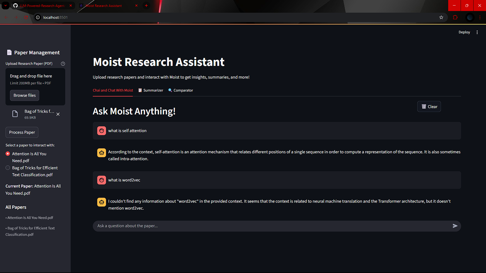
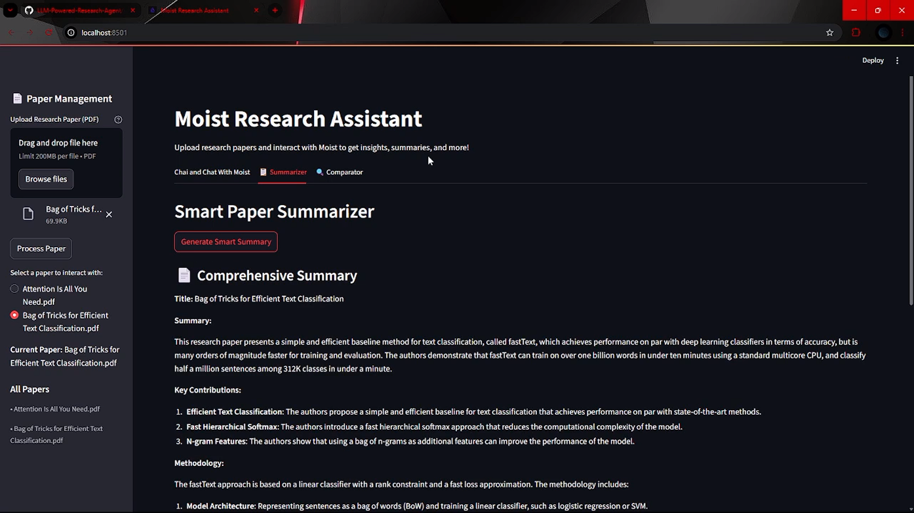
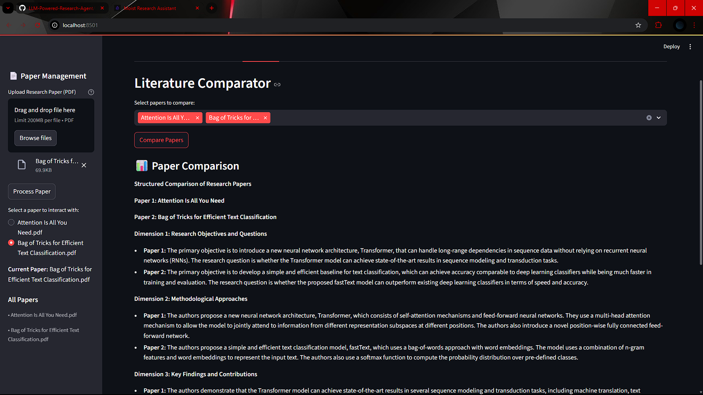

# Core Features

## Basic RAG Pipeline

* PDF Upload & Processing: Users can upload research papers and get them automatically processed
* Vector Store: Uses FAISS for efficient similarity search
* Chat Interface: Conversational RAG to chat with uploaded papers
* LLM: Uses Groq's Llama-3.1-8B model (fast and free)

## LangGraph Agents Implemented

1. Smart Summarizer Agent

* Extracts different sections (abstract, methods, results) step-by-step
* Creates comprehensive summaries with section breakdowns
* Uses multi-step LangGraph pipeline

Note: Assumes the abstract is within the first 3000 characters of the paper (for saving time costs)

2. Literature Comparator Agent

* Compares multiple uploaded papers across key dimensions
* Analyzes research objectives, methods, findings, and limitations
* Structured comparison output

# Technical Architecture

* State Management: Each agent has its own TypedDict state
* LangGraph Pipelines: Sequential and parallel processing nodes
* Streamlit UI: Tabbed interface for different agent functions
* Session State: Maintains chat history and paper database
* Error Handling: Comprehensive error handling throughout

# How it Works

1. **PDF Upload**: Users upload research papers in PDF format.
2. **Processing**: Papers are processed to extract text and metadata.
3. **Similarity Search**: Uploaded papers are indexed in a FAISS vector store and according to user queries, relevant chunks are retrieved.
4. **Chat Interface**: Users can interact with the system to ask questions related to paper's scope (only).

5. **Summarizer**: Users can request summary of the entire paper. Also allows to view section-wise summaries, namely, "Abstract", "Methods", and "Results".

6. **Comparator**: Users can compare multiple papers side-by-side across key dimensions.

